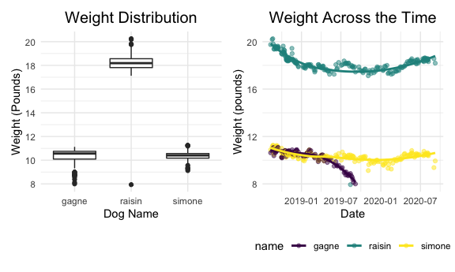

Midterm Project
================
Phoebe Mo
2020-10-23

This is a midterm project intending to analyze the weight of three pet
dogs. Now, I’m going to import the data, tidy, and clean the data.

``` r
weight_data = 
  read_excel("./data/dogweights_07sept2020 (1).xlsx", range = "B2:F207",
             col_types = c("date", "guess", "guess", "guess", "guess")) %>%
  janitor::clean_names() %>%
  drop_na(date) %>%
  subset(raisin != "NA" | simone != "NA" | gagne != "NA") %>%
  pivot_longer(
    raisin:gagne,
    names_to = "name",
    values_to = "weight"
  ) %>%
  mutate(
    weight = str_replace(weight, "1810", "18 10"),
    weight = str_replace(weight, "1803", "18 03")
  ) %>%
  separate(weight, into = c("pound", "ounce"), sep = " ") %>%
  separate(std, into = c("std_pound", "std_ounce"), sep = " ") %>%
  mutate(
    pound = as.numeric(pound),
    ounce = as.numeric(ounce),
    weight = pound + ounce / 16,
    std_pound = as.numeric(std_pound),
    std_ounce = as.numeric(std_ounce),
    std = std_pound + std_ounce / 16
  ) %>%
  select(date, name, weight, std)
```

    ## Warning in read_fun(path = enc2native(normalizePath(path)), sheet_i = sheet, :
    ## Expecting date in B79 / R79C2: got 's'

The raw data is in excel format and the “Date” variable has multiple
forms of expressions, so when importing it, I unify them in a single
form of expression.

Then, I unify the expressions of the names of columns and drop rows that
has no date information as well as rows that has NA in all three dogs’
weight. Since there is only one row that has no date entry, and rows
that has no weight record for all three dogs are useless, this removal
has trivial impact on our later analysis. I also make the weight data
keeps the same format by adding whitespace for later convenience of
manipulating the unit of weight.

Noticing that the raw data is in a wide format where all three pets’
names are the column names which is not tidy, I make it into a long
format. I also convert the weight unit into solely “pounds”, replacing
the confusing format of two numbers(pounds and ounces) in the raw data.
Finally, I rearrange the column sequence to present information for a
better understanding view.

Now, I’m going to create a second data frame containing notes in the raw
data and save the two data frames I made into csv files.

``` r
note_data = 
  read_excel("./data/dogweights_07sept2020 (1).xlsx", range = "B2:G207",
             col_types = c("date", "guess", "guess", "guess", "guess", "guess")) %>%
  janitor::clean_names() %>%
  select(-c(raisin, simone, gagne, std)) %>%
  rename(note = x6) %>%
  drop_na(note)
```

    ## Warning in read_fun(path = enc2native(normalizePath(path)), sheet_i = sheet, :
    ## Expecting date in B79 / R79C2: got 's'

    ## New names:
    ## * `` -> ...6

``` r
write_csv(weight_data, "./data/tidy_weights.csv")
write_csv(note_data, "./data/tidy_notes.csv")
```

In the tidy dataset containing weights, there are totally 603 rows and
each row is a weight information for a single dog in a single day.
Columns include variables of the date, name, weight(pounds), and the
weight of a standard object. There are 201 unique dates included.
Following is a table showing the number of observations for each dog,
along with their average weight and standard deviation.

``` r
weight_data %>%
  group_by(name) %>% 
  summarise(
    num = sum(!is.na(weight)),
    avg_weight = mean(weight, na.rm = T),
    sd_weight = sd(weight, na.rm = T)
  ) %>%
  knitr::kable()
```

    ## `summarise()` ungrouping output (override with `.groups` argument)

| name   | num | avg\_weight | sd\_weight |
| :----- | --: | ----------: | ---------: |
| gagne  | 119 |       10.29 |     0.7081 |
| raisin | 201 |       18.23 |     0.9797 |
| simone | 192 |       10.38 |     0.3841 |

Create a two-panel plot. The first plot shows the distribution of
weights for each dog and the right panel shows each dog’s weight over
time.

``` r
weight_plot =
  weight_data %>%
  ggplot(aes(x = name, y = weight)) +
  geom_boxplot(na.rm = T) +
  theme(plot.title = element_text(size = 15, hjust = 0.5)) +
  labs(title = "Weight Distribution", x = "Dog Name", y = "Weight (Pounds)") +
  scale_y_continuous(breaks = seq(from = 6, to = 22, by = 2))

trend_plot =
  weight_data %>%
  ggplot(aes(x = date, y = weight, color = name)) +
  geom_point(alpha = 0.5, na.rm = T) +
  geom_smooth(alpha = 0.5, se = FALSE, na.rm = T) +
  labs(title = "Weight Across the Time", x = "Date", y = "Weight (pounds)") +
  theme(plot.title = element_text(size = 15, hjust = 0.5))

weight_plot + trend_plot
```

    ## `geom_smooth()` using method = 'loess' and formula 'y ~ x'



Observing the boxplot showing the density of weight for each dog, we can
find that Raisin has much higher weight than Gagne and Simon. There are
many outliers weight for Gagne and the spread of weight distribution is
the least for Simone.

According to the right plot showing each dog’s weight over time, we can
observe that Raisin and Simone have similar weight trend over the time:
the weight decreased and then gradually increased back to near to the
weight level in August 2018. However, Raisin has the biggest fluctuation
in its weight over the time. For Gagne, its weight kept going down,
especially after April of 2019. There is no weight data for Gagne after
September 2019, but at that time, Gagne had the lowest weight among the
three dogs. And Raisin always had the highest weight among the three
dogs.
